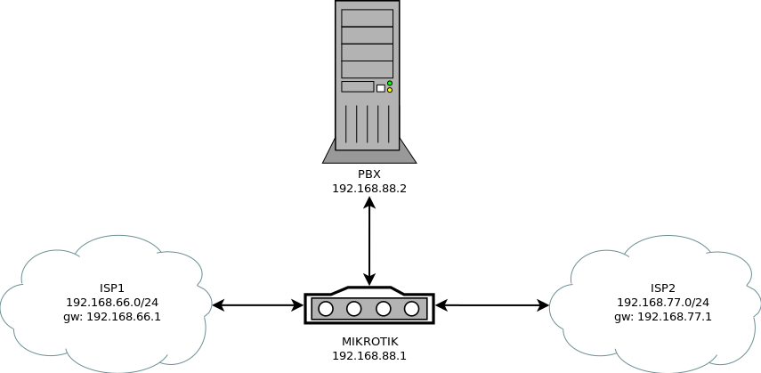

# MultiWAN
MikroTik Multi WAN with PBX  
&nbsp;
## Содержание
+ [Назначение](#назначени)
+ [Схема](#схема)
+ [Описание](#описание)
+ [Установка](#установка)  
&nbsp;&nbsp;
## Назначение
Скрипт будет полезен службам _"такси по вызову"_, использующим роутеры от **[MikroTik](https://mikrotik.com/)**, для применения двух и более Интернет каналов с переключением между ними по схеме **failover**, то есть в тот или иной момент активным является один из каналов.  
&nbsp;&nbsp;
## Схема

  
&nbsp;&nbsp;
## Описание

Вне зависимости от того по какому протоколу вам предоставляет канал оператор связи, маршрут по-умолчанию не должен создаваться автоматически. То есть, если канал подается по протоколу **IPOE** (динамические адреса),то в настройках **dhcp** клиента необходимо указать в качестве параметра **_Add Default Route_** значение no. Точно также, если у вас **vpn** канал (pptp, l2tp или pppoe) вам необходимо в настройках **ppp** соединения убрать галочку с пункта **_Add Default Route_**. Это необходимо проделать потому, что переключение между каналами осуществляется путем создания и удаления маршрутов самим скриптом по необходимости.  

У операторов связи, предоставляющих услуги телефонии (короткие номера), если при активном соединении с одного внешнего адреса будет инициировано параллельное соединение с другого адреса, учетная запись отправляется в бан на продолжительное время (в нашем регионе 40 минут). У соединения есть таймаут (у нашего оператора 3 минуты). То есть при отключении первого канала, поднимается резервный, но при этом соединение с предыдущего адреса еще активно. И попытка соединиться со второго канала отправляет учетку в бан, что оставляет службу такси без связи со своими водителями. Для обхода этой проблемы скрипт перед переключением на резервный канал выдерживает паузу продолжительностью чуть больше времени таймаута у оператора связи. По истечении этого срока соединение само отваливается по таймауту. Затем скрипт поднимает резервный канал и новое соединение. 

Да, при такой схеме переключения, все равно возникает простой связи в несколько минут, но этот простой в 10 раз короче чем при попадании в бан.  
&nbsp;&nbsp;
## Установка

+ После предварительной настройки роутера и каналов следует в разделе **_System > Scheduler_** добавить новую задачу.

+ Укажите необходимые параметры начала и окончания задачи и периодичность ее выполнения, а так же в раздел **_On event_** добавьте исходный код скрипта из этого проекта.

+ Не забудьте внести коррективы в разделе инициализации скрипта (сменить адреса шлюзов, паузы, адрес pbx и прочее).
